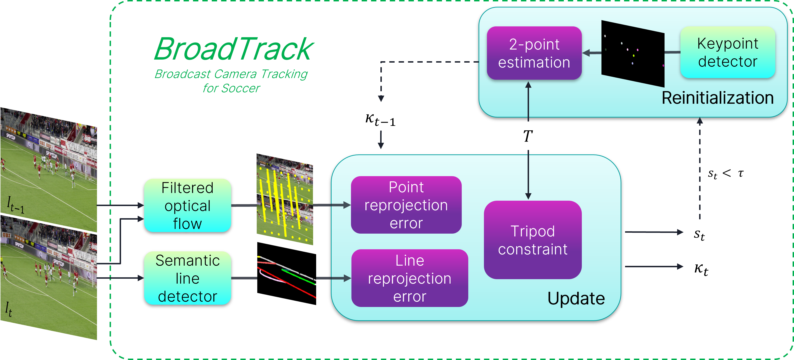

<div align=center>
<h1>BroadTrack: Broadcast Camera Tracking for Soccer</h1>


[](https://arxiv.org/abs/2412.01721) 
</div>


>**[BroadTrack: Broadcast Camera Tracking for Soccer, WACV'25](https://arxiv.org/abs/2412.01721)**
>Floriane Magera, Thomas Hoyoux, Olivier Barnich, Marc Van Droogenbroeck




## 🔎 Abstract:
Camera calibration and localization, sometimes simply named camera calibration, enables many applications in the context of soccer broadcasting, for instance regarding the interpretation and analysis of the game, or the insertion of augmented reality graphics for storytelling or refereeing purposes. To contribute to such applications, the research community has typically focused on single-view calibration methods, leveraging the near-omnipresence of soccer field markings in wide-angle broadcast views, but leaving all temporal aspects, if considered at all, to general-purpose tracking or filtering techniques. Only a few contributions have been made to leverage any domain-specific knowledge for this tracking task, and, as a result, there lacks a truly performant and off-the-shelf camera tracking system tailored for soccer broadcasting, specifically for elevated tripod-mounted cameras around the stadium. In this work, we present such a system capable of addressing the task of soccer broadcast camera tracking efficiently, robustly, and accurately, outperforming by far the most precise methods of the state-of-the-art. By combining the available open-source soccer field detectors with carefully designed camera and tripod models, our tracking system, BroadTrack, halves the mean reprojection error rate and gains more than 15% in terms of Jaccard index for camera calibration on the SoccerNet dataset. Furthermore, as the SoccerNet dataset videos are relatively short (30 seconds), we also present qualitative results on a 20-minute broadcast clip to showcase the robustness and the soundness of our system.


## Install
We provide a docker image, depending on the cuda version on your machine, you might need to pull other nvidia dockers.
```
docker build . -t broadtrack
``` 

## Run
The code assumes that the image folder contains %06d.jpg files as in the soccernet gamestate sequences, or as could be generated using the following command from a video file : ```ffmpeg -i <your video> -q:v 1 <image folder>/%06d.jpg```

```
docker run --rm -it --gpus=all -v <your workdir>:<your workdir> broadtrack:latest /bin/sh
broadtrack --help
broadtrack --f <image folder> --o <output json file> --t <tripod file>
```


## Estimating the camera tripod parameters
First run BroadTrack with default camera parameters from common priors:  
| Camera type | X   | Y   | Z   |
|-------------|-----|-----|-----|
| **cam1** |  0  |  55 | -12 |
| **16mr** | 36  |  55 | -12 |
| **16ml** | -36 |  55 | -12 |
| **hbg**  | -65 |  0  | -15 |

Then starting from the generated calibration file
```
cd script
pip install -r requirements.txt
python compute_tripod.py -i <path to generated calib file> -o <output json file path>
```


## Citation
Please cite our work if you use BroadTrack:
```bibtex
@inproceedings{Magera2025BroadTrack,
title = {BroadTrack: Broadcast Camera Tracking for Soccer},
author = {Magera, Floriane and Hoyoux, Thomas and Barnich, Olivier and Van Droogenbroeck, Marc},
booktitle = {Proceedings of the IEEE/CVF Winter Conference on Applications of Computer Vision (WACV)},
month = {February},
year = {2025},
address = {Tucson, Arizona, USA}
}
```
